# FinalFlaskProject4

- This is Final Flask Application.

- Created my first flask application by following this tutorial and it was very helpful to explore and learn new skills.
[Flask App Tutorial](https://hackersandslackers.com/your-first-flask-application)

## Link to all Parts
# Link to part 1
[Part_1](app)\
# Link to part 2
[Part_2](flask-jinja-tutorial)\
# Link to part 3
[Part_3](flask-wtforms-tutorial)\
# Link to part 4
[Part_4](routing_flask)\
# Link to part 5
[Part_5](configure_flask)\
# Link to part 6
[Part_6](flask_app_factory)\
# Link to part 7
[Part_7](flask_blueprint_tutorial)\
# Link to part 8
[Part_8](flask-assets-tutorials)\
# Link to part 9
[Part_9](flask_sqlalchemy_tutorial)\
# Link to part 10
[Part_10](flasklogin_tutorial)\
# Link to part 11
[Part_11](flask_session_tutorial)

## Snapshots

# GET
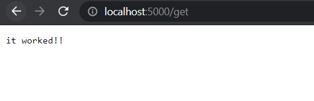
# MARKUP
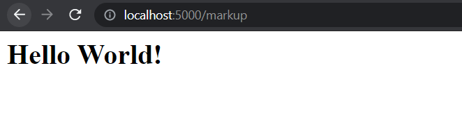
# TEMPLATE
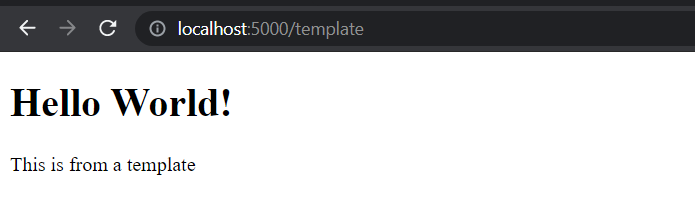
# LOGIC
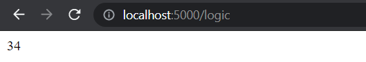
# RENDERING PAGE
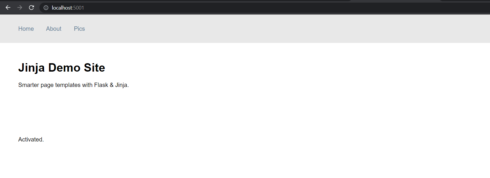
# FORM
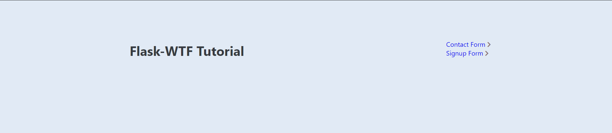
# CONTACT
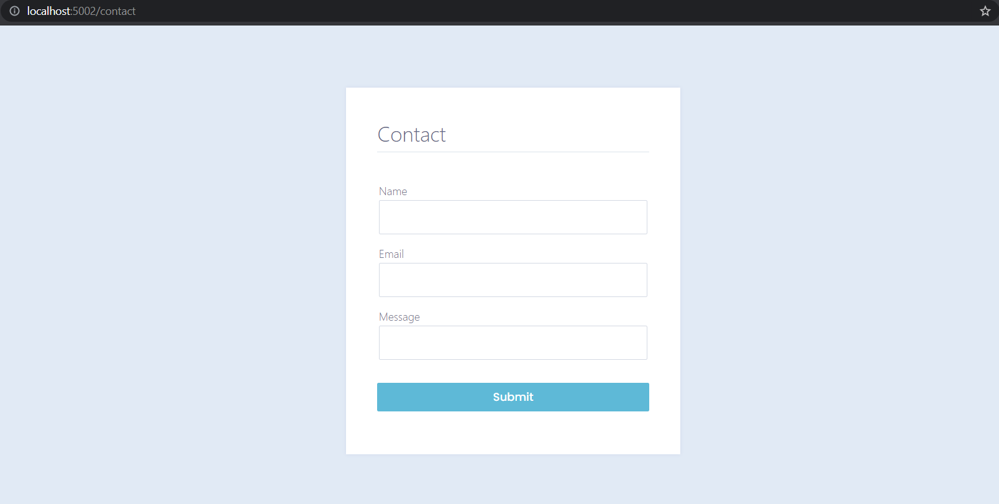
# SIGNUP
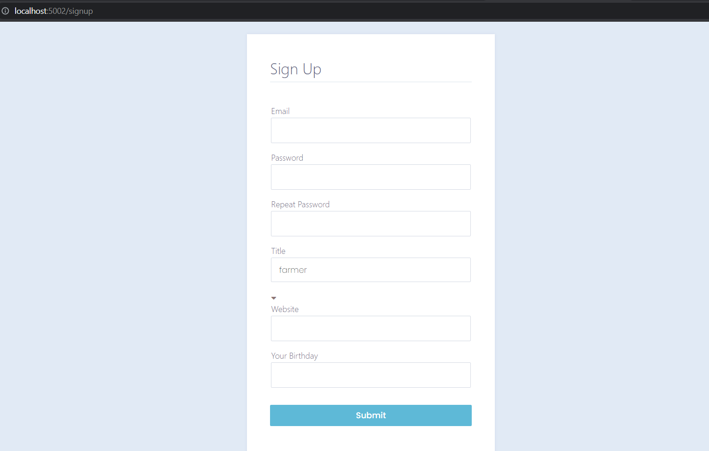
# ROUTING
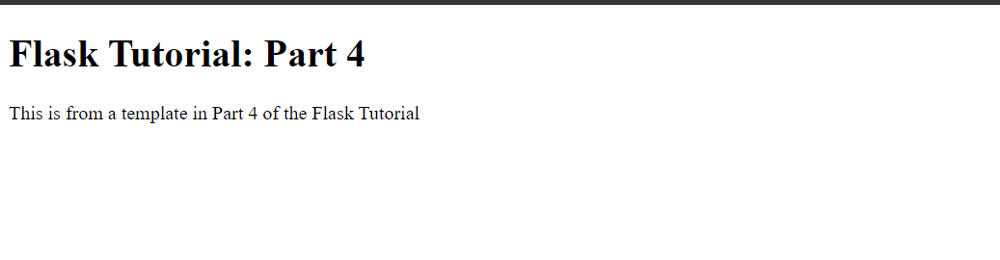
# CONFIG FLASK
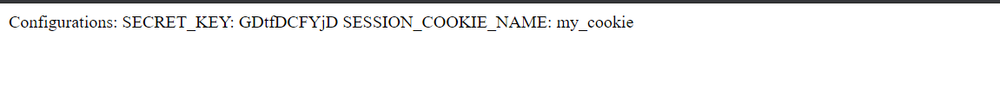
# BLUEPRINT
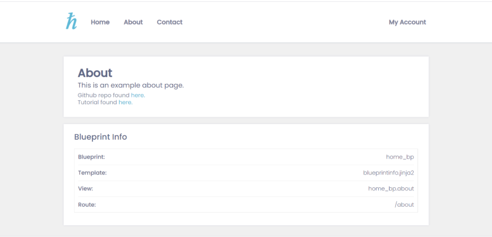
# DATABASE
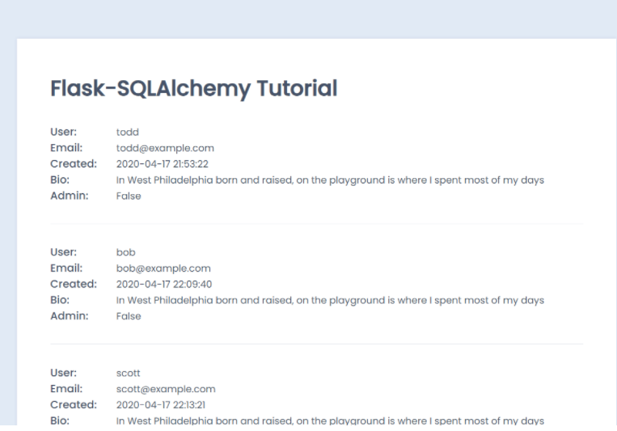
# USER ACCOUNT
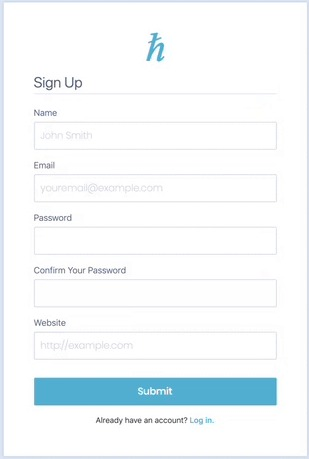
# MANAGE SESSION
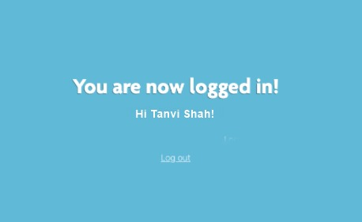
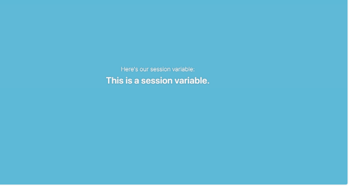

